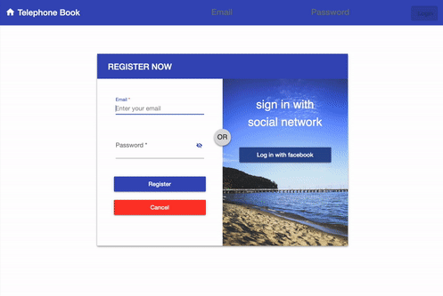

# TelephoneBook

This project was generated with [Angular CLI](https://github.com/angular/angular-cli) version 8.3.2.

## About project
- Login with email and password
- Sigin with Facebook account
- CRUD operation over list of contacts
- Models: Contact model, User model
- Search over list of contacts
- Views: list view, single contact view
- Database: MongoDb, using Mongoose
- Backend: Node.js, using Express.js
- Components: list, create (for both, create and update), header, details (for single contact view)
- Services: Alertify, Auth, FacebookAuth, Contacts
- Guards: Auth guard

## Deployment
Deployment to Amazon Web Services’ Elastic Beanstalk. EB is a PaaS (Platform as a Service) which uses EC2 (Elastic Compute Cloud) and S3 (Simple Storage Service) services.

